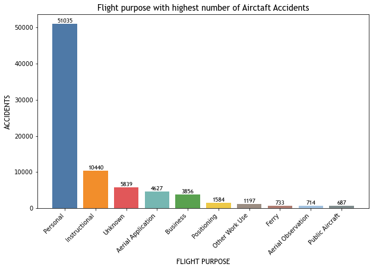
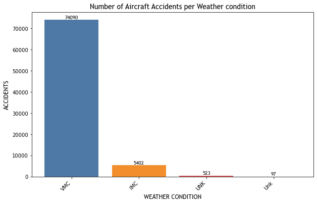
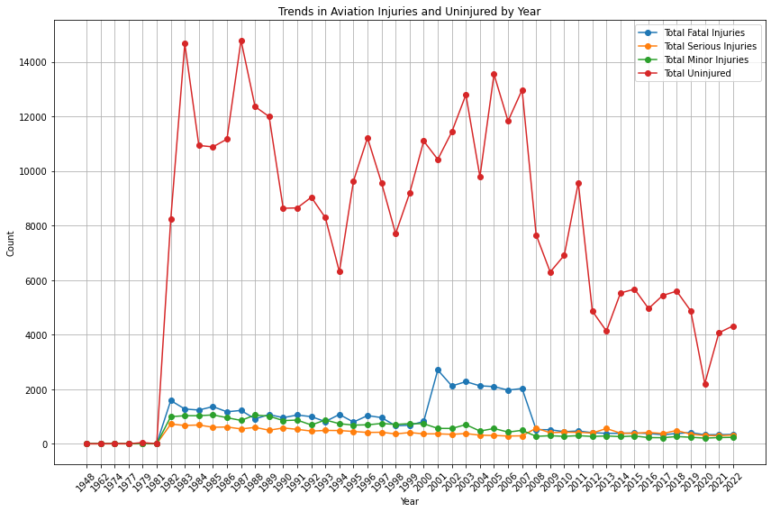

1.0 Overview

Our company is expanding into new industries by purchasing and operating aircraft for both commercial and private enterprises. To ensure a successful entry into this market, it is crucial to identify aircraft with the lowest potential risk of accidents. This report presents an analysis of aircraft accident data to aid in selecting aircraft with the best safety profiles and minimize accident risks.

2.0 Business Understanding
2.1 Industry Context
The aviation industry is inherently complex, with safety being a paramount concern. For a company expanding into aircraft operations, understanding accident data is crucial for minimizing risks and ensuring operational efficiency. The industry is governed by stringent safety regulations and standards, which vary by region and aircraft type. By analyzing historical accident data, the company can make informed decisions about which aircraft models and operational practices are likely to offer the best safety profiles.

2.2 Objectives and Relevance
The primary objective of analyzing aircraft accident data is to identify patterns and factors that contribute to accidents. This analysis helps in selecting aircraft with lower accident risks, thereby enhancing safety and reducing potential financial losses. Key areas of focus include:

Aircraft Specifications: Understanding how design, age, and manufacturer influence accident rates.
Operational Conditions: Evaluating how factors such as weather, pilot experience, and maintenance practices affect safety.
Accident Trends: Observing changes over time to identify emerging risks or improvements in safety standards.
Stakeholder and Key Business Questions:
Stakeholders: Aviation safety authorities, aircraft operators, insurance companies, and aviation division heads.
Key Business Questions: 
What factors are most associated with higher rates of aircraft accidents?
How do different aircraft specifications and operational conditions affect accident rates?
What trends can be observed in accident data over time?
3.0 Data Understanding and Analysis

Source of Data: https://www.kaggle.com/datasets/khsamaha/aviation-accident-database-synopses

The data was sourced from historical records of aircraft accidents. It includes detailed information on aircraft makes, models, number of engines, weather conditions, accident locations, flight purposes, and types of injuries.

Description of Data:

Total Entries: 88,889
Columns: 31
Float Variables: 6
Object Data Types: 26
Data Sample Code:

# Displaying dataset information
Visualizations:
Accidents by Flight Purpose: This visualization shows the frequency of accidents across various flight purpose indicating Personal reasons having higher number of accidents.

Accidents by Aircraft Make: This visualization shows the frequency of accidents across different aircraft makes, highlighting that Cessna and Piper have higher accident rates compared to others.

Accidents by Aircraft Model: This visualization shows the frequency of accidents across different aircraft makes, highlighting that 152 and 172 are the most frequently involved models in accidents, reflecting their high usage.

Accidents by Weather Conditions: A chart displaying the number of accidents under Visual Meteorological Conditions (VMC) and Instrument Meteorological Conditions (IMC), illustrating the predominance of accidents under VMC.

Accidents Over Time: A trend line showing the number of accidents per year from 1982 to 2022, highlighting the general decrease in accidents over time.

4.0 Conclusion

Summary of Conclusions:

Number of Engines:

Aircraft with a single engine are involved in the majority of accidents. Dual-engine aircraft, however, experience significantly fewer accidents due to their redundancy in case of engine failure.
Weather Conditions:

The majority of accidents occur under Visual Meteorological Conditions (VMC). This is due to the higher frequency of VMC compared to Instrument Meteorological Conditions (IMC), not necessarily due to the inherent danger of VMC.
Location:

Anchorage, Alaska, has the highest number of recorded aircraft accidents, whereas cities like Albuquerque, Houston, and Miami have relatively lower accident rates. This indicates that location-specific factors, such as weather and traffic patterns, contribute to accident risks.

5.0 Recommendations

Number of Engines:

Opt for aircraft with at least two engines to leverage the safety benefits of redundancy, which generally results in lower accident rates.
Weather Considerations:

Ensure that aircraft are equipped to handle a range of weather conditions, including IMC, even though most accidents occur under VMC. This preparation can enhance overall safety.
Location:

Be cautious of operating in high-accident locations such as Anchorage, Alaska. Consider routes or locations with lower accident rates to minimize risk.
Flight Purpose:

Prefer aircraft used for business or professional purposes over those used for personal flights. Business flights typically adhere to stricter operational standards, leading to a lower accident rate.
Avoid High-Accident Makes and Models:

To improve safety, avoid aircraft makes with high accident rates such as Cessna and Piper. Consider makes with fewer accidents, like Mooney or Robinson, and models with lower accident rates, such as the Cessna 150M.
Trend Analysis:

Choose newer aircraft models or those with recent safety updates. The observed trend indicates a decrease in accident rates over time, reflecting advancements in aviation safety.